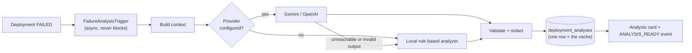

# AI failure analysis

When a deployment fails, DeployForge gathers the evidence it already has and produces a root cause, the log
lines that support it, a suggested fix and a confidence value.

The design constraint that shapes everything here: **the analysis must be checkable**. An explanation you
cannot verify is barely better than a guess, so evidence is part of the output, and the analyzer that
produced it is always named.

## Flow



Analysis runs **after** the deployment is already marked failed, on its own thread. A slow or unavailable
model cannot delay the deployment result.

## What the model receives

| Included | Excluded |
| --- | --- |
| Project name, framework, runtime | Environment variable **values** |
| Failed stage, platform message, exit code | Repository source code |
| Install / build / start commands, port, health path | GitHub tokens, JWT secrets, the encryption key |
| Branch and short commit sha | Anything from other projects or tenants |
| Generated Dockerfile (truncated) | |
| Environment variable **names** | |
| Recent log lines and error lines (already redacted) | |

Two independent safeguards: the context type has no field capable of carrying a value, and every log line
was redacted before it was ever stored. Redaction is applied again to the model's answer, in case it echoed
something back.

## The prompt

`AiPromptFactory` holds the system prompt as code, so it is reviewable in diffs rather than buried in a
client. It instructs the model to:

- analyse **only** the supplied evidence
- name a single most probable root cause
- never invent files, commands, variables or infrastructure
- separate facts (quoted from logs) from hypotheses
- never request or output secret values
- prefer concrete remediation over general advice
- **state uncertainty and lower confidence** rather than speculate
- return one JSON object, no prose, no markdown fence

Requested schema:

```json
{
  "summary": "",
  "rootCause": "",
  "evidence": [""],
  "suggestedFixes": [{ "title": "", "description": "", "command": null }],
  "severity": "LOW | MEDIUM | HIGH | CRITICAL",
  "confidence": 0.0
}
```

## Output is untrusted input

`AiResponseParser` treats model output as hostile-by-default data. It:

- extracts the JSON object even when fenced or wrapped in prose - models do this constantly
- **rejects** a response with no root cause and no summary, rather than rendering an empty card
- clamps `confidence` to 0..1 and converts a percentage (`92`) to a fraction (`0.92`)
- normalises an unknown severity to `MEDIUM` instead of failing
- caps evidence, fix count and field lengths so a runaway response cannot bloat the database or the UI
- **strips destructive commands** — `rm -rf`, `docker system prune`, `docker rm/rmi/kill`, `DROP TABLE`,
  `TRUNCATE`, `kubectl delete`, `git push --force`, `curl | sh`, `chmod 777`, `mkfs`, `dd if=`, reboot —
  even when the model returns them
- redacts the whole result

If nothing usable comes back, the analysis is stored as `UNAVAILABLE` and the UI says so plainly. There is
no fabricated fallback text.

Every one of those behaviours is covered by `AiResponseParserTest`.

## The local analyzer

`HeuristicAiProvider` is the default (`AI_PROVIDER=heuristic`) and the fallback when a provider fails. It
needs no key and makes no network call, so failure analysis works on a fresh clone.

It reads the same real logs a model would and matches ordered rules, most specific first:

| Signal | Conclusion |
| --- | --- |
| `Environment variable not found: X` | Names `X`; distinguishes "not configured" from "set but rejected" |
| `Cannot find module 'x'` | Undeclared dependency, or a relative import that was not committed |
| `ModuleNotFoundError: No module named 'x'` | Missing Python package |
| `EADDRINUSE` / address in use | Hard coded port instead of the injected `PORT` |
| `npm ci` lockfile mismatch | Missing or stale `package-lock.json`, suggests `npm install` |
| `ERESOLVE` / peer dependency | Conflicting versions |
| TypeScript `TSxxxx`, Maven/Gradle `COMPILATION ERROR` | Compilation failure |
| `OutOfMemoryError` / OOMKilled | Memory limit exceeded — severity `CRITICAL` |
| `ECONNREFUSED` to a database port | Unreachable dependency, likely a `localhost` connection string |
| Health check timeout, container still running | Bound `127.0.0.1` instead of `0.0.0.0`, or wrong health path |
| Health check timeout, non-zero exit code | Process died on startup — a different conclusion, deliberately |
| No recognised signal | Says so, confidence below 0.4 |

Confidence reflects how specific the match was: a named variable scores ~0.95, an unmatched failure ~0.35.
It is labelled `heuristic` in the API, the log and the analysis card, so nobody mistakes rules for a model.

## Caching

One row per deployment, keyed by `deployment_id`. A deployment's failure never changes, so analysis is
computed once. `POST .../analysis?force=true` re-runs it deliberately; ordinary reads never re-bill a
provider.

## The DevOps chat

Same provider abstraction, different shape. The model cannot query anything: the backend selects from a
fixed set of read-only tools, runs them itself, and passes the rendered result as context.

`getProjectSummary`, `getLatestDeployment`, `getRecentDeployments`, `getFailedDeployments`,
`getDeploymentLogs`, `getDeploymentAnalysis`, `getProjectHealth`, `getContainerStats`,
`getEnvironmentVariableNames`.

Tool selection is keyword driven, which makes it predictable and cheap, and the tools that ran are returned
to the UI and displayed under each answer. There is no tool that deploys, restarts, deletes, rotates a
secret or runs a command — the model can recommend such things in prose, and performing them always requires
the user to press a button.

## Adding a provider

Implement `AiProvider` (`name`, `isConfigured`, `analyzeDeploymentFailure`, `chat`), register it as a bean,
and set `AI_PROVIDER` to its name. The registry resolves it, falls back to the local analyzer when it is
unconfigured, and nothing else in the codebase changes — which is the point of the interface.
