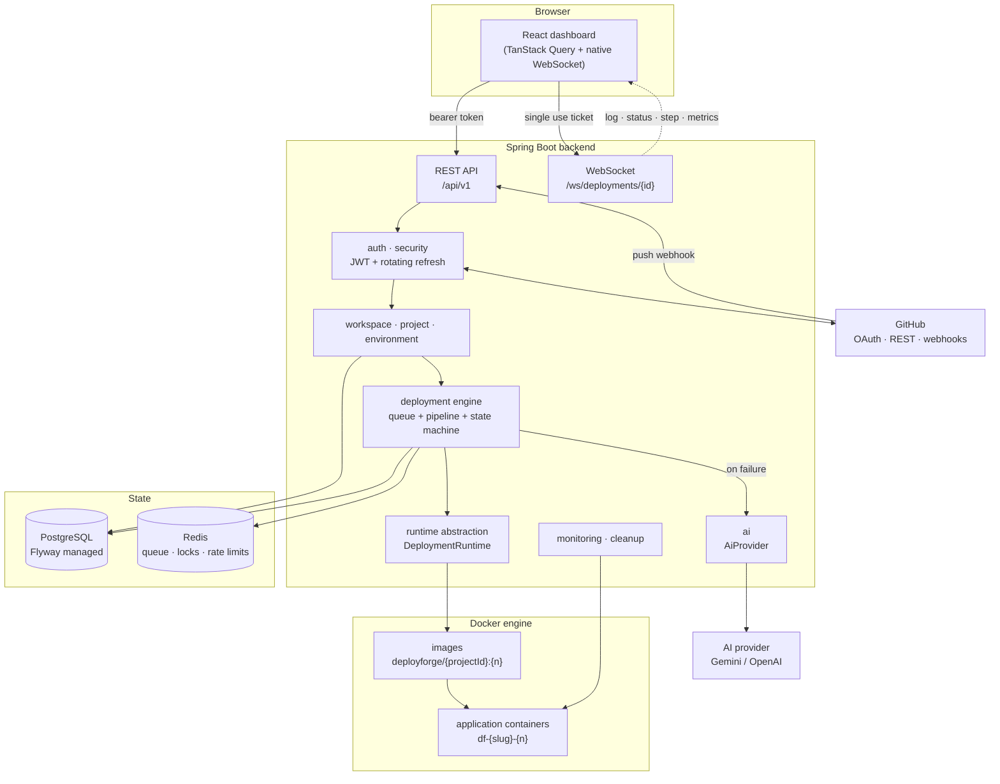

# Architecture

DeployForge AI is a **single node** deployment platform. One host runs the control plane (this
application, PostgreSQL, Redis) and the workloads it deploys (Docker containers). That is a deliberate
scope decision: the interesting engineering is the deployment pipeline, the state machine, streaming and
failure analysis, and none of it needs a cluster to be real.

Everything that would have to change for multiple nodes sits behind an interface, so the choice is
reversible rather than baked in.

## System overview

## Modules

Package per bounded concern, under `com.deployforge`:

| Module        | Responsibility                                                                   |
| ------------- | -------------------------------------------------------------------------------- |
| `auth`        | GitHub OAuth flow, session issuing, refresh rotation, WebSocket tickets           |
| `security`    | JWT, AES-GCM encryption, secret redaction, rate limiting, filter chain            |
| `user`        | Identity, account endpoints                                                       |
| `workspace`   | Tenancy, membership, the role → permission matrix, all authorization decisions    |
| `project`     | Projects, build configuration, domains, import                                    |
| `environment` | Environments and encrypted variables                                              |
| `github`      | GitHub REST client and the user-scoped service around it                          |
| `detection`   | Framework detection over an abstract `SourceInspector`                            |
| `deployment`  | Deployments, state machine, queue, pipeline steps, promotion, rollback            |
| `runtime`     | `DeploymentRuntime`, `DomainRoutingService`, port allocation, Docker implementation |
| `git`         | JGit based cloning                                                               |
| `log`         | Deployment log ingestion, redaction, cursor paginated reads                       |
| `monitoring`  | Container stats sampling, project health                                          |
| `ai`          | `AiProvider`, prompts, response validation, analysis storage, DevOps chat         |
| `webhook`     | Signature verification, delivery idempotency, auto deploy                         |
| `notification`, `activity` | In-app notifications and the append-only activity trail             |
| `cleanup`     | Scheduled retention for build directories, containers, images, logs, metrics      |

## The three abstractions that matter

**`DeploymentRuntime`** — everything that touches containers. `DockerDeploymentRuntime` is the only
implementation; a `KubernetesDeploymentRuntime` or a remote build worker would be a second one, with no
change to the pipeline, the domain or the API.

**`DomainRoutingService`** — how a container becomes reachable. `LocalPortDomainRoutingService` publishes
a host port and returns `http://host:port`. A reverse proxy implementation would return
`https://<slug>.<domain>` and rewrite routing on promotion; the `project_domains` row it maintains already
has the right shape for both.

**`AiProvider`** — the seam to any model vendor. Gemini, OpenAI and a local rule based analyzer implement
it. Nothing outside the `ai` package imports a vendor SDK, and a missing API key degrades to the local
analyzer instead of breaking the feature.

Two smaller ports keep module dependencies pointing one way:
`ProjectDeploymentSnapshotProvider` (so the projects list can show deployment status without `project`
depending on `deployment`) and `FailureAnalysisTrigger` (so the pipeline can request analysis without
depending on `ai`).

## Request paths

**Synchronous** — REST calls validate, authorize and either read or write. They never build, clone or
call Docker.

**Asynchronous** — `POST /deployments` writes a `QUEUED` row, pushes the id to Redis and returns. Worker
threads pick it up, acquire a per-environment lock and run the pipeline. Nothing long running ever holds
an HTTP thread or a database transaction.

**Streaming** — pipeline steps append log lines, which are persisted and pushed over WebSocket in the same
call. The browser merges the historical page with the live stream by sequence number.

## State ownership

PostgreSQL is the source of truth: users, workspaces, projects, environments, encrypted variables,
deployments, steps, logs, analyses, metrics, notifications, activity, webhook deliveries. Flyway owns the
schema and Hibernate runs with `ddl-auto=validate`, so the application can never quietly alter it.

Redis holds only things that may be lost without corrupting anything: the deployment queue, per-environment
locks, port leases, log sequence counters, OAuth state, refresh token hashes, WebSocket tickets and rate
limit counters. Losing Redis costs sessions and queued work, not history.

## What is intentionally not here

Kubernetes, billing, multi-region, serverless functions, database provisioning, autoscaling, enterprise
SSO and certificate automation. Each would be a plausible next step, and the interfaces above are where
each would attach. See the roadmap in the root README.
