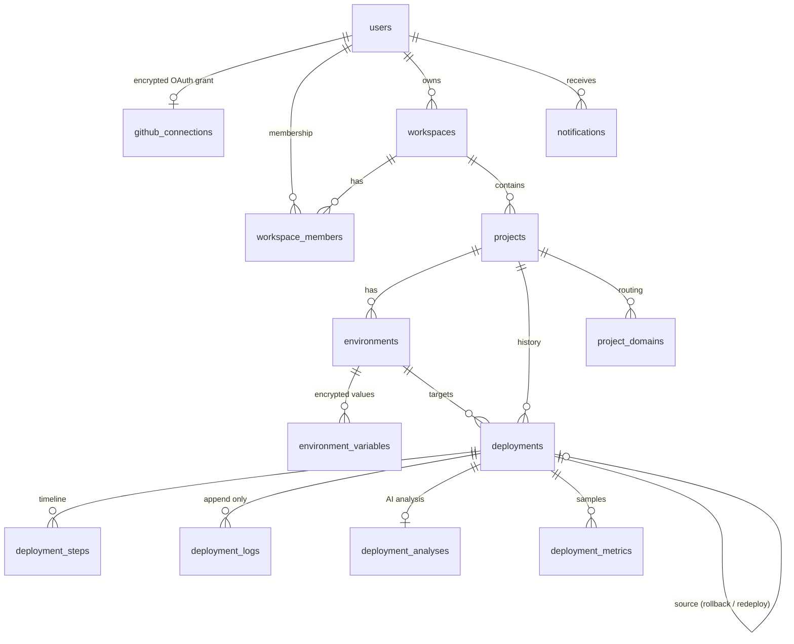

# Database schema

PostgreSQL, owned by Flyway (`backend/src/main/resources/db/migration`). Hibernate runs with
`ddl-auto=validate`: it verifies the mapping against the real schema at startup and can never alter it.

## Entity relationships



`activity_events` and `webhook_deliveries` are intentionally unlinked: the first is an append-only audit
trail that must survive the deletion of what it describes, the second exists purely for delivery
idempotency.

## Tables

| Table                   | Purpose | Notable columns |
| ----------------------- | ------- | --------------- |
| `users`                 | GitHub-backed identity | `github_user_id` unique - the immutable account id, not the renameable handle |
| `github_connections`    | OAuth grant | `access_token_encrypted` (AES-256-GCM), `scopes`, one per user |
| `workspaces`            | Tenant boundary | `slug` unique |
| `workspace_members`     | Membership + role | unique `(workspace_id, user_id)` |
| `projects`              | Deployable app | unique `(workspace_id, slug)`; build config is the project default |
| `environments`          | Deploy target | unique `(project_id, name)`; `branch`, `auto_deploy_enabled` |
| `environment_variables` | Encrypted config | unique `(environment_id, env_key)`; `encrypted_value` only - no plaintext, no preview column |
| `deployments`           | One shipping attempt | unique `(project_id, deployment_number)`; snapshots framework and commands; `promoted` marks the live one |
| `deployment_steps`      | Timeline | unique `(deployment_id, step)`; per-step status and duration |
| `deployment_logs`       | Log lines | unique `(deployment_id, sequence_number)` - the pagination cursor |
| `deployment_analyses`   | AI analysis | unique `deployment_id` - also the cache key |
| `deployment_metrics`    | Resource samples | `bigserial`; retention enforced by the cleanup job |
| `project_domains`       | Routing | `hostname` unique; `kind` SYSTEM or CUSTOM |
| `notifications`         | In-app alerts | `is_read`; `read` avoided as a column name |
| `activity_events`       | Audit trail | actor, action, resource, metadata, timestamp - append only |
| `webhook_deliveries`    | Idempotency | `delivery_id` unique |

## Design decisions

**Build configuration is snapshotted onto every deployment.** A deployment from three weeks ago shows the
framework, commands and port it actually ran with, even after someone edits the project. It is also what
lets a rollback reuse an image without guessing.

**History is immutable.** Redeploy and rollback create new rows with `source_deployment_id` pointing at the
original. Nothing rewrites a past deployment.

**Log sequence numbers, not offsets.** Logs are appended while clients read them; an offset would skip or
duplicate lines, a per-deployment monotonic sequence never does.

**`promoted` rather than "current".** Exactly one deployment per environment owns traffic. The flag flips at
the same moment routing switches, so "ready" and "serving" cannot drift apart.

**No plaintext secret column anywhere.** Not even a truncated preview - a preview of a secret is still a
partial secret.

## Indexes

Beyond primary keys and unique constraints:

```
ix_users_github_username
ix_workspace_member_workspace_user      (workspace_id, user_id)
ix_workspace_member_user                (user_id)
ix_project_workspace                    (workspace_id, created_at DESC)
ix_project_repository                   (repository_owner, repository_name)   -- webhook lookup
ix_environment_project                  (project_id)
ix_env_var_environment_key              (environment_id, env_key)
ix_deployment_project_created           (project_id, created_at DESC)
ix_deployment_environment_created       (environment_id, created_at DESC)
ix_deployment_status                    (status)
ix_deployment_step_order                (deployment_id, sequence_number)
ix_deployment_log_cursor                (deployment_id, sequence_number)      -- cursor pagination
ix_deployment_metric_recent             (deployment_id, sampled_at DESC)
ix_notification_user_created            (user_id, created_at DESC)
ix_activity_workspace_created           (workspace_id, created_at DESC)
ix_activity_project_created             (project_id, created_at DESC)
ix_webhook_delivery_received            (received_at DESC)
```

Each one backs a query that actually exists: history listing, the cursor read of logs, webhook project
lookup, metric charts, the notification badge and the activity feed.

## Cascades and retention

`ON DELETE CASCADE` flows workspace → projects → environments → variables and projects → deployments →
steps, logs, analyses, metrics. Deleting a project releases its infrastructure **first** (containers,
images, build directories) and only then deletes rows, because the container ids needed for cleanup live in
the rows about to disappear.

`created_by` uses `ON DELETE SET NULL`, so removing a user does not erase deployment history.

Retention, applied hourly by `CleanupJob`: build directories (24h), logs (30 days), metrics (72h),
notifications (30 days), activity (90 days), webhook deliveries (7 days). Images belonging to recent
successful deployments are preserved regardless of age, because deleting a rollback target to save disk
space is the wrong trade.

## Migrations

| Version | Description |
| ------- | ----------- |
| `V1__initial_schema.sql` | Full schema: 15 tables, constraints, indexes |
| `V2__deployment_generated_dockerfile.sql` | Stores the generated Dockerfile as reviewable build metadata and AI evidence |

Migrations are additive and never edited after release. `baseline-on-migrate` is enabled so an existing
database can adopt Flyway cleanly.
