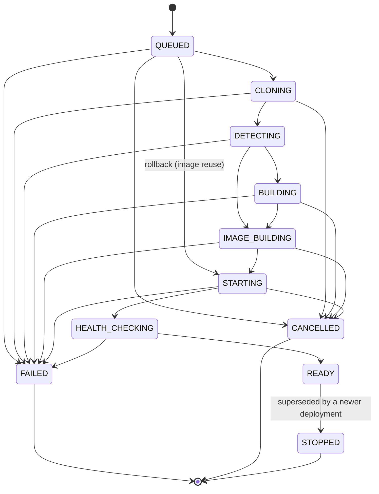
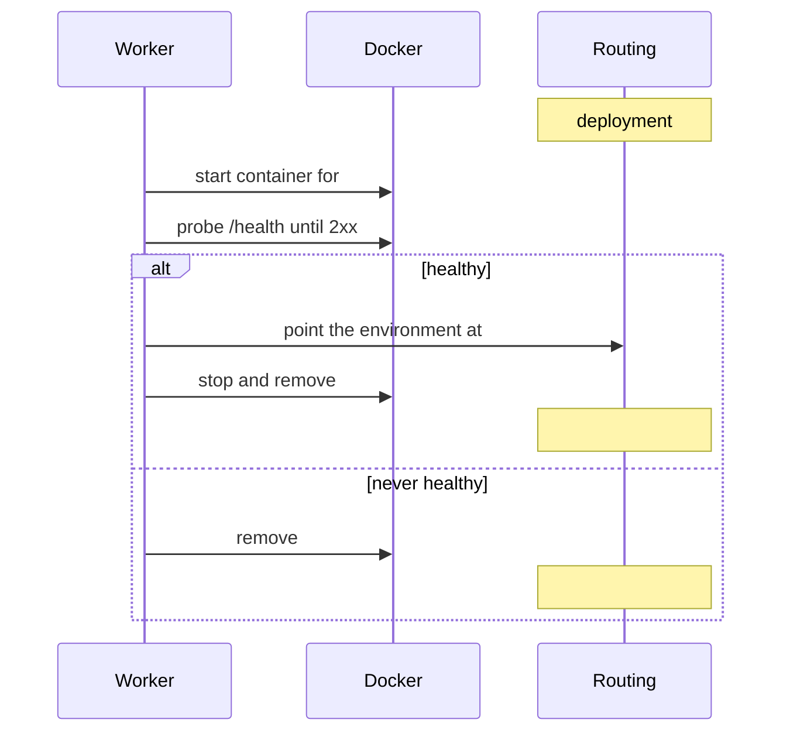

# Deployment pipeline

A deployment is a state machine driven by an ordered list of steps. Each step does one thing, updates the
deployment's status, writes to the log, emits a real-time event and throws a typed exception when it
cannot continue.

## States

`DeploymentStateMachine` is the only thing that may change a status. Transitions are forward-only, aborts
are always allowed from an active state, and terminal states are terminal: `FAILED → READY` throws rather
than corrupting history. The rules are covered directly by `DeploymentStateMachineTest`.

`QUEUED → STARTING` is the single shortcut, and it exists for rollbacks: the image already exists, so
cloning, detection and building are legitimately skipped.

## Steps

| Step              | Status            | What it does                                                      |
| ----------------- | ----------------- | ----------------------------------------------------------------- |
| `QUEUE`           | `QUEUED`          | Row created by the API, id pushed onto the Redis queue            |
| `CLONE`           | `CLONING`         | Shallow single-branch clone via JGit into an isolated directory    |
| `DETECT`          | `DETECTING`       | Framework detection against the real checkout                     |
| `BUILD`           | `BUILDING`        | Writes the build plan: Dockerfile (committed or generated), ignore file |
| `IMAGE_BUILD`     | `IMAGE_BUILDING`  | `docker build` - this is where install and build actually run      |
| `CONTAINER_START` | `STARTING`        | Allocates a port, injects variables, starts the container with limits |
| `HEALTH_CHECK`    | `HEALTH_CHECKING` | Probes until 2xx/3xx, detects a crashed container early            |
| `FINALIZE`        | `READY`           | Switches routing, marks ready, retires the previous container      |

Dependency installation and the application build run **inside** the image build, not on the host. That is
what makes a deployment reproducible, and it is why `BUILD` is named "build plan prepared" rather than
pretending to compile anything.

## Zero-downtime promotion

The previous container keeps serving until the new one passes its health check. A failed deployment
therefore changes nothing: it is a failed deploy, not an outage. This ordering lives in
`DeploymentPromotionService`.

## Concurrency

One deployment per environment at a time, enforced with a Redis `SET NX EX` lock held by the worker. A
deployment whose environment is busy goes back on the queue rather than racing, so ordering is preserved
per environment while different environments deploy in parallel. Worker count is bounded by
`deployforge.deployment.worker-concurrency`, because a single host cannot build many images at once.

The lock has a TTL, so a crashed worker cannot deadlock an environment forever.

## Cancellation

Cancellable while `QUEUED`, `CLONING`, `DETECTING`, `BUILDING`, `IMAGE_BUILDING`, `STARTING` or
`HEALTH_CHECKING`. The API sets a Redis flag and a column; the running pipeline polls it between
operations, and JGit and the Docker build stream both observe it mid-flight. On cancellation the container
is removed, the port lease released, the working copy deleted and the deployment marked `CANCELLED`.

## Failure handling

Every failure produces a stage, a message and, where known, an exit code. `StepFailedException` also
carries a remediation hint, which is what appears as "Hint:" in the log.

After a failure:

1. the failing step is marked `FAILED` on the timeline, later steps stay `PENDING` (not reached)
2. the container is removed and the port lease released - the **image is kept** so it remains a rollback
   target, and the working copy is kept for the retention window as evidence
3. a notification fans out to the workspace
4. AI analysis is triggered asynchronously, after the logs are persisted so it sees real evidence

Platform failures are distinguished from user failures. An unreachable Docker engine reports "the Docker
engine is unavailable", never "your build failed".

## Crash recovery

On startup the worker reconciles: deployments left non-terminal by a previous process are failed with an
explicit message, and `QUEUED` ones are pushed back onto the queue. Nothing is left showing "Building"
forever.

## Idempotency

- **Deployment numbers** — allocated with `max + 1` inside a retry loop; the unique constraint on
  `(project_id, deployment_number)` is the real guard, so two concurrent deploys can never both be "#42".
- **Webhooks** — GitHub delivery ids are inserted first; a duplicate insert means the retry was already
  handled. This works across instances, unlike an in-memory cache.
- **Runtime operations** — `stop` and `remove` treat a missing container as success.
